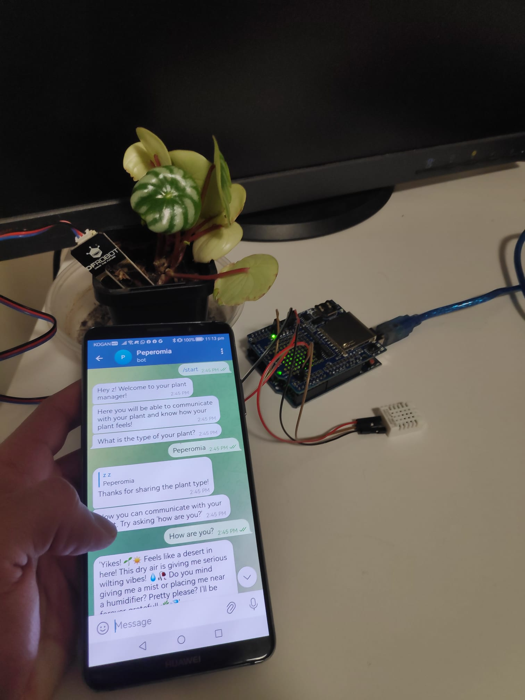
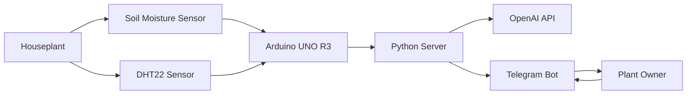

# Peperomia

**Peperomia** is an AI-powered plant-human chat system that gives a houseplant a conversational interface. The project combines environmental sensing, an Arduino-based hardware layer, a Python server, the Telegram API, and the OpenAI API to let users ask their plant how it is doing and receive responses based on real sensor data.

The goal of the project is to make indoor plant care more interactive and approachable by translating plant environment readings into simple, human-friendly messages.

---

## Demo

### Demo Picture



### Demo Video

<video src="./resources/demo-video.mp4" controls width="100%"></video>

[Open the demo video](./resources/demo-video.mp4)

> If your repository uses different file extensions, update the paths above to match the actual files in the `resources/` folder.

---

## Overview

Peperomia follows a simple **Sense → Think → Act** flow:

1. **Sense**  
   Sensors collect environmental data from the plant's surroundings, including temperature, humidity, and soil moisture.

2. **Think**  
   The Python server processes the sensor readings and interprets the plant's current condition or “mood”.

3. **Act**  
   When the user sends a message through Telegram, the chatbot responds using the plant's current state and generates a more natural, conversational reply.

---

## Features

- Reads plant environment data using Arduino-compatible sensors.
- Measures temperature and humidity using a DHT22 sensor.
- Measures soil moisture using an Arduino soil moisture sensor.
- Sends sensor data from Arduino to a Python server through serial communication.
- Uses Telegram as the user-facing chat interface.
- Uses the OpenAI API to generate natural language responses.
- Gives the plant a more engaging and human-like personality.

---

## System Architecture



The Arduino gathers raw environmental data from the sensors. The Python server receives this data, processes it, and manages the chatbot logic. Telegram acts as the communication channel between the user and the plant.

---

## Hardware Components

- Arduino UNO R3
- DHT22 temperature and humidity sensor
- Arduino soil moisture sensor
- Jumper wires and breadboard/prototyping components
- Adafruit Data Logger Shield, used during testing and evaluation
- Indoor houseplant

---

## Software Components

- Python 3.8+
- Arduino IDE
- Telegram Bot API
- OpenAI API
- Serial communication between Arduino and Python

---

## Repository Structure

```text
peperomia/
├── Arduino_code/
│   └── peperomia.ino
├── server_code/
│   ├── main.py
│   ├── agents.py
│   └── arduino.py
├── resource/
│   ├── demo-picture.png
│   └── demo-video.mp4
├── requirements.txt
└── README.md
```

> The exact file names may vary depending on how the repository was exported. The structure above reflects the intended organisation of the Arduino code, Python server code, and project resources.

---

## Getting Started

### 1. Clone the Repository

```bash
git clone https://github.com/<your-username>/peperomia.git
cd peperomia
```

### 2. Set Up the Python Environment

```bash
cd server_code
python -m venv .venv
```

Activate the virtual environment:

```bash
# Windows
.venv\Scripts\activate

# macOS/Linux
source .venv/bin/activate
```

Install dependencies:

```bash
pip install -r ../requirements.txt
```

If a `requirements.txt` file is not available, install the required packages manually based on the imports used in the Python source files.

### 3. Configure Environment Variables

Create a `.env` file inside the `server_code/` directory:

```env
OPENAI_API_KEY=your_openai_api_key
TELEGRAM_BOT_TOKEN=your_telegram_bot_token
ARDUINO_PORT=your_arduino_serial_port
```

Example serial ports:

```text
Windows: COM3
macOS: /dev/tty.usbmodemXXXX
Linux: /dev/ttyACM0
```

### 4. Upload the Arduino Program

1. Open the Arduino sketch inside `Arduino_code/`.
2. Connect the Arduino UNO R3 to your computer.
3. Select the correct board and serial port in the Arduino IDE.
4. Upload the sketch to the board.

### 5. Run the Python Server

From the `server_code/` directory:

```bash
python main.py
```

Once the server is running, open Telegram and start a conversation with the configured bot.

---

## Usage

After the hardware and server are running, the user can message the Telegram bot with questions such as:

```text
How are you?
```

The system reads the latest available plant data, determines the plant's current condition, and returns a conversational response through Telegram.

---

## Project Design

Peperomia is built around a lightweight prototype architecture:

- **Arduino layer**: captures environmental readings from the plant's surroundings.
- **Server layer**: processes sensor data, manages chatbot logic, and communicates with external APIs.
- **AI layer**: generates natural language responses that make the plant feel more expressive.
- **Chat layer**: allows the plant owner to interact with the system through Telegram.

This design keeps the prototype modular and makes it easier to extend individual parts of the system, such as adding more sensors, improving the plant mood logic, or supporting additional messaging platforms.

---

## Possible Future Improvements

- Add wireless communication between the Arduino and the server.
- Improve plant condition classification using more accurate thresholds or a trained model.
- Add plant species recognition using image classification.
- Support voice-based interactions.
- Improve privacy and security around user conversations and environmental data.
- Expand the system to support multiple plants at once.
